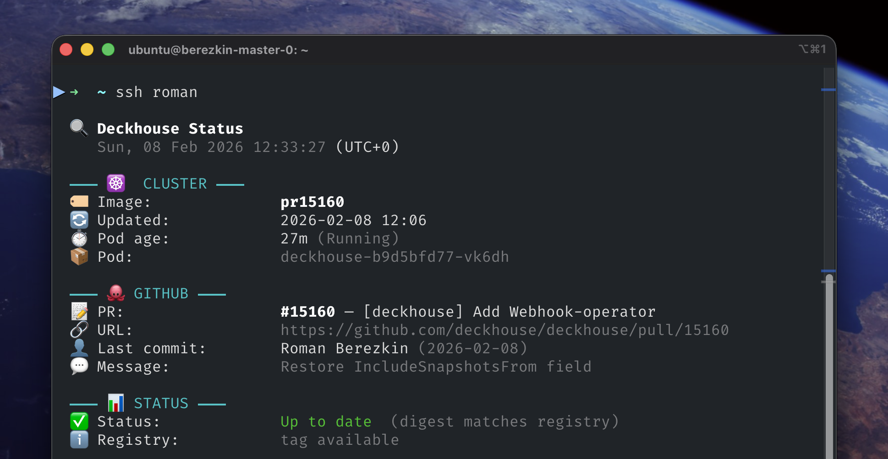

# 📡 deckhouse-status

CLI-утилита для нод dev/test кластера. Отвечает на вопрос: **"Актуален ли мой PR-билд Deckhouse?"**

Собирает данные из трёх источников (Kubernetes API, GitHub API, Docker Registry), сравнивает дайджесты образов и показывает результат.

## Пример вывода



## Установка

```bash
curl -fsSL https://raw.githubusercontent.com/glitchy-sheep/deckhouse-status/main/install.sh | bash
```

Скрипт определяет OS/arch, скачивает бинарник из GitHub Releases и кладёт в `/usr/local/bin`.

### Сборка из исходников

```bash
make build-linux-amd64
scp deckhouse-status-linux-amd64 root@master-node:/usr/local/bin/deckhouse-status
```

Другие цели: `make build` (локальная), `make build-all` (все платформы).

## Использование

```bash
deckhouse-status                       # полный вывод (таймзона: Europe/Moscow)
deckhouse-status -s                    # компактный вывод (2-3 строки)
deckhouse-status --tz America/New_York # IANA-имя
deckhouse-status --tz +5               # числовой офсет
```

### Флаги

| Флаг            | Описание                                                                |
| --------------- | ----------------------------------------------------------------------- |
| `-s`, `--short` | Компактный вывод                                                        |
| `--tz`          | Таймзона: IANA-имя или число (`+3`, `-5`). По умолчанию `Europe/Moscow` |
| `--no-github`   | Пропустить GitHub API                                                   |
| `--no-registry` | Пропустить проверку реестра                                             |
| `--no-color`    | Без цветов                                                              |
| `--no-emoji`    | Без эмодзи                                                              |
| `--timeout`     | Таймаут в секундах (по умолчанию 15)                                    |

### Команды

| Команда          | Описание                                                                                                                                          |
| ---------------- | ------------------------------------------------------------------------------------------------------------------------------------------------- |
| `watch-build`    | Ждать завершения CI-билда (с live-спиннером). `--timeout 3600` (по умолчанию 60 мин), `--restart` — автоматический рестарт деплоймента при успехе |
| `install-motd`   | Установить скрипт автозапуска при SSH-входе (требует `sudo`)                                                                                      |
| `uninstall-motd` | Удалить скрипт автозапуска                                                                                                                        |
| `edit-motd`      | Редактировать флаги в скрипте автозапуска                                                                                                         |

## Как определяется статус

1. **Основной способ** — сравнение дайджеста запущенного пода с дайджестом тега в реестре
2. **Запасной** (если тег удалён GC) — сравнение времени создания пода с временем завершения CI-билда

Редакция (FE/CE/EE) определяется автоматически из суффикса тега образа.

## Требования

- Kubernetes-доступ
- Сетевой доступ к `api.github.com` и dev-реестру Deckhouse
- Секрет `deckhouse-registry` в namespace `d8-system`
